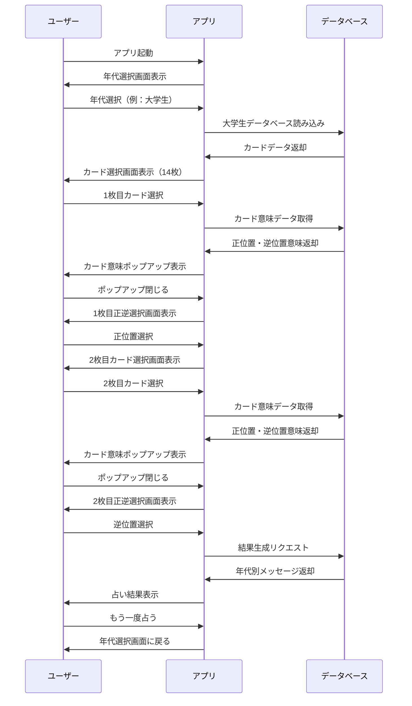
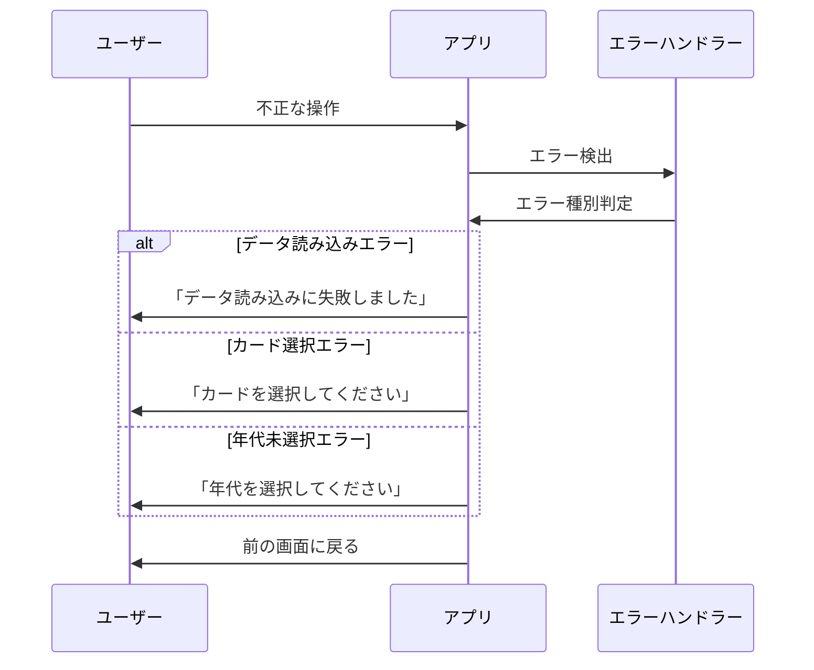
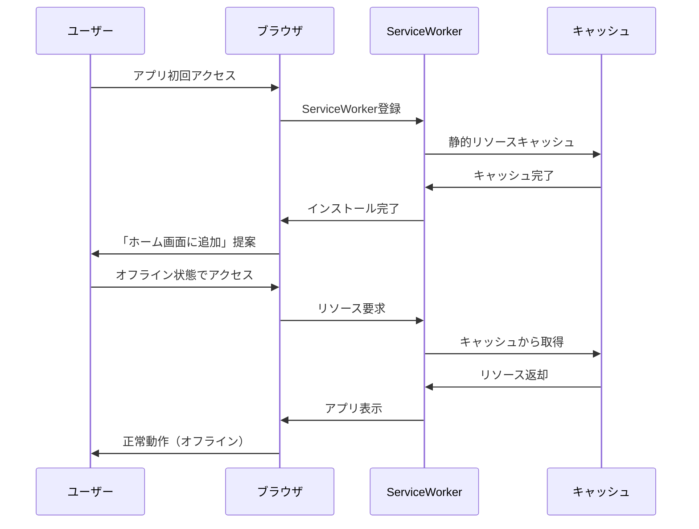

<!--
<style>
@media print {
  body {
    font-family: "Hiragino Sans", "Yu Gothic", sans-serif;
    font-size: 9px;
    line-height: 1.3;
    margin: 0.5in;
    color: #333;
  }
  
  h1 {
    font-size: 16px;
    margin: 8px 0 6px 0;
    page-break-after: avoid;
  }
  
  h2 {
    font-size: 14px;
    margin: 6px 0 4px 0;
    page-break-after: avoid;
  }
  
  h3 {
    font-size: 12px;
    margin: 4px 0 3px 0;
    page-break-after: avoid;
  }
  
  h4 {
    font-size: 10px;
    margin: 3px 0 2px 0;
    page-break-after: avoid;
  }
  
  p {
    margin: 2px 0;
    font-size: 9px;
  }
  
  ul, ol {
    margin: 2px 0;
    padding-left: 15px;
  }
  
  li {
    margin: 1px 0;
    font-size: 9px;
  }
  
  pre {
    font-size: 7px;
    line-height: 1.2;
    margin: 3px 0;
    padding: 3px;
    background: #f5f5f5;
    border: 1px solid #ddd;
  }
  
  code {
    font-size: 8px;
    background: #f5f5f5;
    padding: 1px 2px;
  }
  
  .mermaid {
    font-size: 7px;
    max-width: 100%;
  }
  
  /* 改ページ制御 */
  .page-break {
    page-break-before: always;
  }
  
  /* テーブルスタイル */
  table {
    font-size: 8px;
    width: 100%;
    border-collapse: collapse;
  }
  
  th, td {
    padding: 2px 4px;
    border: 1px solid #ddd;
  }
  
  /* 余白調整 */
  @page {
    margin: 0.5in;
    size: A4;
  }
}
</style>
-->

# タロット占いアプリ プロダクトドキュメント

## 1. 要件定義

### 1.1 プロダクト概要
美女と野獣をテーマにした年代別タロット占いWebアプリケーション。ユーザーの年代に応じて最適化されたメッセージでタロット占いを提供する。

### 1.2 機能要件

#### 1.2.1 基本機能
- **年代選択機能**: 高校生、大学生、社会人、シニアの4つの年代から選択
- **カード選択機能**: 14枚のタロットカードから2枚を選択
- **カード意味表示機能**: 選択されたカードの意味をポップアップで表示
- **正逆判定機能**: 各カードの正位置・逆位置をランダム判定
- **結果表示機能**: 年代に応じたメッセージで占い結果を表示
- **リスタート機能**: 占いを最初からやり直す機能

#### 1.2.2 年代別データベース
- **高校生版**: 文化祭風の親しみやすいメッセージ
- **大学生版**: キャンパスライフに寄り添うアドバイス
- **社会人版**: キャリアと人生設計に関する指針
- **シニア版**: 人生経験を活かした新たな挑戦への励ま

#### 1.2.3 UI/UX要件
- **モバイルファースト設計**: スマートフォンでの利用を最優先
- **レスポンシブデザイン**: 各デバイスサイズに最適化
- **直感的操作**: タップ操作での簡単なカード選択
- **視覚的フィードバック**: カード選択時のアニメーション効果

### 1.3 非機能要件

#### 1.3.1 パフォーマンス
- ページ読み込み時間: 3秒以内
- カード選択からの反応時間: 1秒以内

#### 1.3.2 対応環境
- **ブラウザ**: Chrome, Safari, Firefox, Edge (最新版)
- **デバイス**: スマートフォン、タブレット、PC
- **PWA対応**: オフライン機能、ホーム画面追加

## 2. システム設計

### 2.1 アーキテクチャ概要
- **フロントエンド**: HTML5, CSS3, Vanilla JavaScript
- **データ管理**: ローカルストレージ + JavaScript配列
- **デプロイ**: GitHub Pages (静的サイト)

### 2.2 データ構造

#### 2.2.1 カードデータ
```javascript
{
  id: number,
  nameEn: string,
  nameJp: string,
  positive: {
    meaning: string,
    description: string,
    situation: string,
    advice: string
  },
  negative: {
    meaning: string,
    description: string,
    situation: string,
    advice: string
  }
}
```

#### 2.2.2 年代別データベース
```javascript
const ageGroupDatabases = {
  'highschool': tarotCardsHighSchool,
  'university': tarotCardsUniversity,
  'professional': tarotCardsProfessional,
  'senior': tarotCardsSenior
}
```

### 2.3 コンポーネント設計

#### 2.3.1 主要コンポーネント
- **AgeSelector**: 年代選択画面
- **CardSelector**: カード選択画面
- **CardMeaningModal**: カード意味表示モーダル
- **OrientationSelector**: 正逆選択画面
- **ResultDisplay**: 結果表示画面

#### 2.3.2 状態管理
```javascript
const gameState = {
  currentAgeGroup: string,
  selectedCards: array,
  cardOrientations: array,
  currentStep: number
}
```

### 2.4 レスポンシブデザイン
- **Desktop (1024px+)**: 5列カードレイアウト
- **Tablet (768px-1023px)**: 4列カードレイアウト
- **Mobile (480px-767px)**: 5列コンパクトレイアウト
- **Small Mobile (~479px)**: 5列最小レイアウト

## 3. シーケンス図

### 3.1 基本占いフロー



### 3.2 エラーハンドリング



### 3.3 PWA機能



## 4. 開発・運用

### 4.1 開発環境
- **エディタ**: VS Code / Cursor
- **バージョン管理**: Git + GitHub
- **デプロイ**: GitHub Actions → GitHub Pages
- **テスト**: 手動テスト + ブラウザ開発者ツール

### 4.2 品質管理
- **コードレビュー**: Pull Request ベース
- **テスト項目**: 各年代での動作確認、レスポンシブ確認
- **パフォーマンス**: Lighthouse スコア確認

### 4.3 今後の拡張計画
- **多言語対応**: 英語版の追加
- **カード追加**: 新しいタロットカードの実装
- **アニメーション強化**: より豊かな視覚効果
- **データ分析**: 利用統計の収集と分析 